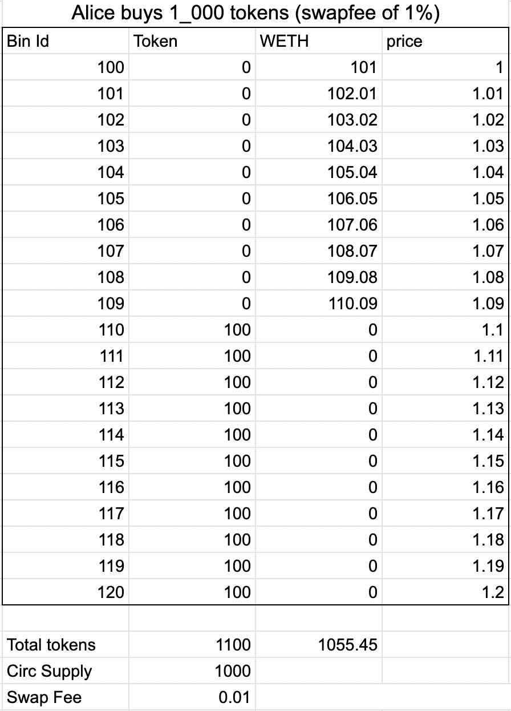
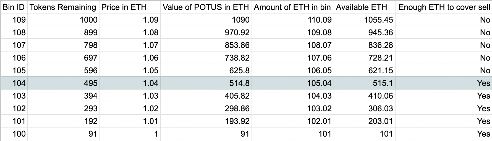
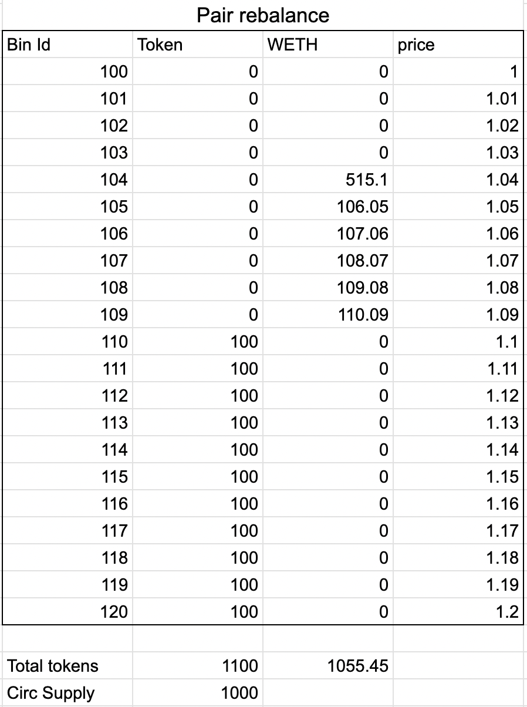

# How It Works

There are several mechanics that are required to make a rising RFV work:

1. Rebalancing of ETH into the RFV or floor price bin  
2. Ensuring continuous liquidity from RFV bin to active price bin  
3. A non-decreasing RFV  

In addition, a unique feature of FLOOR (compared to LOTUS) is the ability to:

4. Mint tokens after pool has been seeded

## Where LOTUS and Previous Forks Went Wrong

LOTUS and its subsequent forks all calculated the RFV price using the formula `amount_of_ETH / circulating_supply_of_FLOOR`.

When a rebalance is triggered, the new RFV would be calculated and typically 90% of ETH in the pool would be allocated to the RFV price bin and the remaining 10% would fill anchor bins, which are the bins between the RFV bin and the current active price bin.

In some cases, the anchor bins would provide continuous liquidity of ETH from RFV to current price to absorb any sells.

In other cases however, the anchor bins would only span a few bins below current price and there would be a large liquidity gap from the anchor bins to RFV. Once the anchor bins are depleted, price dramaticlly drops down to RFV price and the protocol would find it incredibly hard to recover back. Many forks fell short because of this liquidity gap.

Another issue many forks encountered was due to assumption that `amount_of_ETH` in the pool only comes from swappers swapping in their ETH for LOTUS.

It does not take into account ETH being deposited into the pool from external liquidity providers or earned from swap fees.

As a result, this caused faulty RFV calculation and made it hard to rebalance correctly.

## Algorithm to Calculate Risk-Free Value (RFV)

Instead of using the formula `amount_of_ETH / circulating_supply_of_FLOOR` to calculate RFV price, we propose an iterative algorithm instead. This algorithm has the added benefit of never having a gap of liquidity between RFV and active price. Thus, it solves points 1 and 2 together.

The algorithm works like this:

Let `activeId` be the active price bin and the price of that bin be `price(activeId)`.

Once a rebalance is triggered (e.g. after a swap), we calculate the total amount of ETH owned by the token (and not by the pool as there could be external LPs), `totalETH`, and the circulating supply of FLOOR, `circFLOOR`.

> **Circulating supply** here is defined as the total supply of FLOOR **minus** the FLOOR owned by the token in the pair (as they can't be withdrawn without buying the tokens).

Then we simulate if there's enough `totalETH` to absorb sell pressure if we dumped all `circFLOOR` at the price in the bin `activeId - 1`. The value of ETH if we sold all the circulating FLOOR at that price is `circFLOOR * price(activeId - 1) = valueETH`.

If `valueETH > totalETH`, then the price `price(activeId - 1)` is too high to absorb all sells of circulating FLOOR so we iterate to the next bin down, `activeId - 2`.

Once again we calculate `valueETH`, but with a caveat this time: we simulate that the ETH in the bin above, `activeId - 1`, has all its ETH converted to FLOOR and then check if we have enough ETH to absorb the rest of the circulating supply of FLOOR.

To do this, first we convert all the ETH to FLOOR in bin `activeId - 1`, which is `reserveETH(activeId - 1) / price(activeId - 1)`.

Then we subtract this from the circulating supply of FLOOR to get the new circulating supply and multiply this new circulating supply with the price in `activeId - 2`:  
`valueETH = (circFLOOR - reserveETH(activeId - 1) / price(activeId - 1)) * price(activeId - 2)`

Then we check if `valueETH <= totalETH - reserveETH(activeId - 1)`. If not, we iterate down to the next bin and so on.

We do this until we land on a bin where `value_ETH <= total_ETH - sum_i(reserveETH(activeId - i))`. Once it does, it means we have found a bin, `activeId - i`, that can absorb all the sells of FLOOR, and thus, that bin becomes the new RFV price.

Here comes the fun part - to rebalance, we only take ETH from all bins smaller than `activeId - i` and place them in bin `activeId - i`. All bins with ETH above `activeId - i` remain **untouched**. This also means that **there is never a gap of liquidity between RFV and active bin**.

That was quite hard to follow so let's illustrate it with an example below.

### Example

#### Initial Distribution

Protocol seeds 2100 FLOOR tokens into the FLOOR/ETH pool which has a bin step of 0.01 ETH.

The liquidity is equally distributed with 100 FLOOR in each bin across 21 bins from starting price of 1 ETH per FLOOR to 1.2 ETH per FLOOR.

#### First Buy

Alice is the first buyer of the pool and opts to buy 1000 FLOOR tokens. Because 1000 FLOOR has been removed from the initial bins, circulating supply is now 1000.

Assuming a 1% swap fee, the current price is now 1.09 ETH per FLOOR and the bins look like this:

#### Rebalance

After the buy, a rebalance is triggered by the protocol to redistribute ETH into the RFV bin.

To find the RFV price, we use an iterative algorithm that simulates whether there's enough ETH in the pool if the entire circulating supply of FLOOR (1000) is sold at the current price (1.09 ETH per FLOOR).

First we sum up the ETH in the pool and get 1055.45 ETH - this is the `totalETH`.

Then we get the circulating supply of FLOOR valued in ETH, which is 1000 * 1.09 = 1090 - this is the `valueETH`.

Because `valueETH > totalETH`, we cannot make 1.09 the RFV price so we move down to next bin 1.08 and then we repeat the algorithm again.

First we subtract the amount of ETH currently in the 1.09 bin from `totalETH`, which is 1055.45 - 110.09 = 945.36 ETH - this is the new `totalETH`.

Then we get the new circulating supply if the price moved down to 1.09. We get this by finding the amount of FLOOR that would fill the 1.09 bin if all the ETH in there had been converted to FLOOR, which is 110.09 / 1.09 = 101 FLOOR.

Then we subtract current circulating supply by this number to get 1000 - 101 = 899 FLOOR - this is the new `circFLOOR`.

We then calculate the new `valueETH` which is 899 * 1.08 = 970.92 ETH.

As `valueETH > total_ETH` still, we iterate down to the 1.07 bin and repeat once again.

We've already calculated the first bin where `valueETH <= totalETH` in the table below, which is 1.04 ETH per FLOOR. Thus, 1.04 becomes the new RFV.

Now that we have our RFV price of 1.04, we execute our rebalance. Remember:

- All bins above 1.04 remain untouched  
- All bins below 1.04 are rebalanced into 1.04  

Therefore, we simply take all the ETH in bins 1, 1.01, 1.02 and 1.03, and put them into 1.04.

#### What About Sells?

If Alice then sells FLOOR back into the pool, no rebalancing is necessary as we've already proven that the invariant holds and the current RFV price is low enough to absorb as much sell pressure.

#### What if Circulating Supply Increases?

Circulating supply can only increase if more FLOOR is bought from the initial bins.

As these FLOOR tokens are bought in exchange for ETH which is locked into the pool forever, any circulating supply increase will always have a corresponding increase in ETH in the pool that can absorb sell pressure.

## A Non-Decreasing RFV

The last component to making FLOOR work is ensuring RFV never decreases.

If we think about how RFV is calculated using the algorithm above, there are two ways to ensure this mechanic:

1. Reducing circulating supply of FLOOR  
2. Any increase in circulating supply of FLOOR is matched by an equal or greater increase in ETH into the pool  

### 1. Reducing Circulating Supply of FLOOR

This is achieved by taxing all transfers of FLOOR, which includes buying and selling, and burning the taxed FLOOR.

The transfer tax of FLOOR is set to 4.5%.

### 2. Any Increase in Circulating Supply of FLOOR is Matched by an Equal or Greater Increase in ETH into the Pool

We ensure this because when FLOOR is bought from an initialy seeded bin, it is exchanged for an equal amount of ETH.

However, we go one step further and say that it's matched by a **greater** amount of ETH because of the swap fees.

E.g. if there are 100 FLOOR tokens in the 1 ETH per FLOOR bin and swap fee is 1%, then it will take 101 ETH and not 100 ETH to buy all 100 FLOOR.

Thus this invariant also holds.

## Minting Tokens After Pool has been Seeded

A unique feature of FLOOR is the ability to mint more tokens even after the pool has been created and seeded.

The differs from LOTUS and its forks because in those implementations, the token had to be 100% pre-minted and seeded into the bins. Since those tokens are placed in higher priced bins, it acts as a large "sell wall" which can hinder price discovery.

Instead, FLOOR allows you to mint and seed liqiudity to any number of bins you want, with some constraints:

- The amount of FLOOR seeded to each bin is set  
- You can only seed to the next bin up after the last bin seeded  
- You can only seed to consecutive bins  

For example, if the last bin seeded was bin 120 with 100 FLOOR, then the protocol can call the function `raiseRoof(10)`, which will seed bins 121–130 each with 100 FLOOR.
